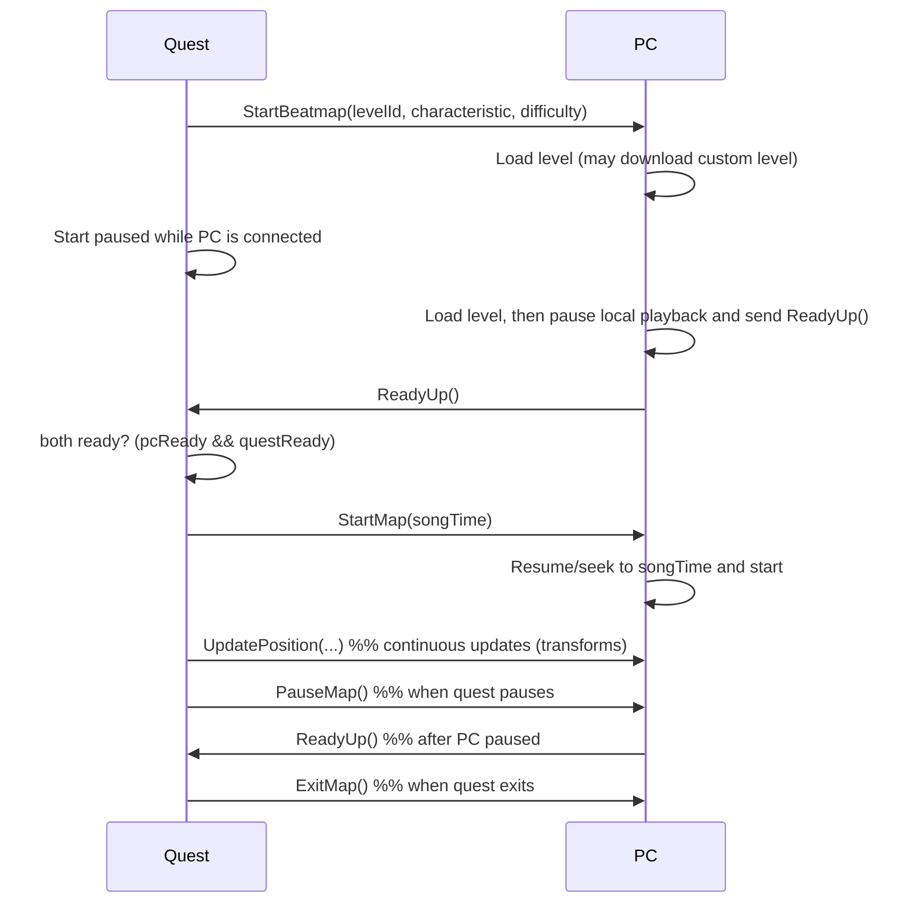

**Protocol: Packet flow between Quest (qmod) and PC (pcmod)**

- **Purpose**: document the protobuf-based packets exchanged between the Quest native mod (`qmod`) and the PC managed mod (`pcmod`) so developers can reason about startup, pause/resume, and position updates.
- **Proto file (source of truth)**: [protos/live_stream.proto](protos/live_stream.proto#L1)

**Overview**
- Communication uses a single `PacketWrapper` oneof (see proto). Packets flow over the socket/websocket handler implemented in the Quest mod ([qmod/src/manager.cpp](qmod/src/manager.cpp#L1)). The PC side handlers are in [pcmod/Managers/Network/MenuPacketHandler.cs](pcmod/Managers/Network/MenuPacketHandler.cs#L1) and [pcmod/Managers/Network/GamePacketHandler.cs](pcmod/Managers/Network/GamePacketHandler.cs#L1).
- Roles:
  - Quest (`qmod`): initiates level starts, reports quest-side events (pause/exit), coordinates starting time when both sides are ready and transform updates.
  - PC (`pcmod`): loads/starts the level when requested, pauses until told to start, sends readiness.
- Start flow now begins paused when the PC is connected. Quest loads the level, keeps playback paused, and only sends `StartMap` once both `pcReady` and `questReady` are true.

**Primary packet types & semantics**
- `StartBeatmap` (Quest -> PC)
  - Sent by Quest when a level is initiated locally.
  - Fields (from code): `levelId` (string), `characteristic` (string), `difficulty` (int/enum).
  - Handled by: [MenuPacketHandler.HandlePacket / StartLevel](pcmod/Managers/Network/MenuPacketHandler.cs#L1).
  - Purpose: instruct PC to load the same beatmap (may trigger download of custom levels).

- `StartMap` (Quest -> PC)
  - Sent by Quest when both PC and Quest have reported readiness; includes precise start time.
  - Fields: `songTime` (float / timestamp offset).
  - Handled by: [GamePacketHandler.HandlePacket](pcmod/Managers/Network/GamePacketHandler.cs#L1) — causes the PC to anchor its local audio clock, resume/seek, and start playback.
  - Produced by: Attempt to start in Quest's `Manager::tryStartGame()` ([qmod/src/manager.cpp](qmod/src/manager.cpp#L1)).

- `PauseMap` (Quest -> PC)
  - Sent by Quest when the song is paused on Quest side (e.g., pause hook in `AudioTimeSyncController_Pause`).
  - Handled by PC by pausing local playback and then sending a `ReadyUp` back to Quest after pausing.

- `ExitMap` (Quest -> PC)
  - Sent by Quest when the level exits (end/fail/stop).
  - Handled by PC to stop song and return to menu.

- `ReadyUp` (PC -> Quest)
  - Sent by PC to indicate it has paused and is ready to be started/resumed by Quest.
  - Handled by Quest in `Manager::processMessage` → `readyPCUp()` which sets the `pcReady` flag.

- `UpdatePosition` (Quest -> PC)
  - Sent by Quest with tracked transforms for `Head`, `Left`, `Right`, plus `Time` and `SongTime`.
  - Produced by Quest's `PlayerPositionUpdater` coroutine (see `qmod/src/PlayerPositionUpdater.cpp`) and handled on PC by `GamePacketHandler` → `VRControllerManager.UpdateTransforms` to update remote player representation.
  - PC-side rendering uses `SongTime` as the primary ordering key and prunes/interpolates snapshots against the current synced song clock, so controller poses stay aligned with audio.

- `StartBeatmapFailure` (PC -> Quest)
  - Sent by PC when the requested beatmap cannot be started (e.g., missing resources or other errors).
  - Includes `error` string. Quest logs and (TODO) may surface user notification.

**Typical sequence (high-level)**

**Where code lives (quick links)**
- Quest-side (C++ / qmod): [qmod/src/main.cpp](qmod/src/main.cpp#L1), [qmod/src/manager.cpp](qmod/src/manager.cpp#L1)
- PC-side (C# / pcmod): [pcmod/Managers/Network/MenuPacketHandler.cs](pcmod/Managers/Network/MenuPacketHandler.cs#L1), [pcmod/Managers/Network/GamePacketHandler.cs](pcmod/Managers/Network/GamePacketHandler.cs#L1)
- Protobuf schema: [protos/live_stream.proto](protos/live_stream.proto#L1)

**Field-level notes & important behaviors**
- `songTime` synchronization: Quest drives the authoritative song time. Quest sets `initSongTime` on StartWait and communicates the precise `songTime` in `StartMap` so the PC can seek/align audio.
- Start-paused logic: `MenuTransitionsHelper_StartStandardLevel` now passes `startPaused` when the PC is connected so the Quest side waits in pause immediately, rather than starting playback and pausing later.
- Readiness handshake: PC explicitly pauses and sends `ReadyUp` before the Quest will send `StartMap`. Quest tracks `pcReady` and `questReady` booleans in `Manager`.
- Pausing behavior: When Quest pauses, Quest sends `PauseMap` and expects PC to pause and reply with `ReadyUp`. Quest suspends starting until both sides are ready.
- Quest readiness comes from the audio path: `AudioTimeSyncController_ResumeSong` and `AudioTimeSyncController_StartSong` are the triggers that mark Quest ready, not a continue-button hook.
- `StartMap` also seeds the PC-side time sync manager with the authoritative `songTime`, so controller playback begins on the same clock domain as audio instead of waiting for the first movement snapshot.
- Position updates: `UpdatePosition` is a frequent packet (low-latency) sent from Quest to PC delivering transforms and timing to keep the remote representation in sync.
- Position updates are applied relative to song time, not packet arrival time. This is important because the PC render loop should only advance controller poses as the current audio clock approaches each snapshot's `SongTime`.
- Error handling: `StartBeatmapFailure` is used for recoverable errors on PC; Quest currently logs the error and contains a TODO for user notification.

**Development notes / TODOs**
- Ensure `UpdatePosition` frequency and packet sizes fit the transport latency expectations.
- Add explicit versioning to the proto (if not present) to avoid compatibility issues.
- Surface `StartBeatmapFailure` errors to the Quest UI from `Manager::processMessage`.

If you'd like, I can also:
- extract the exact proto message fields into a table (from [protos/live_stream.proto](protos/live_stream.proto#L1)),
- add packet field types and full generated name mappings for C# and C++.
